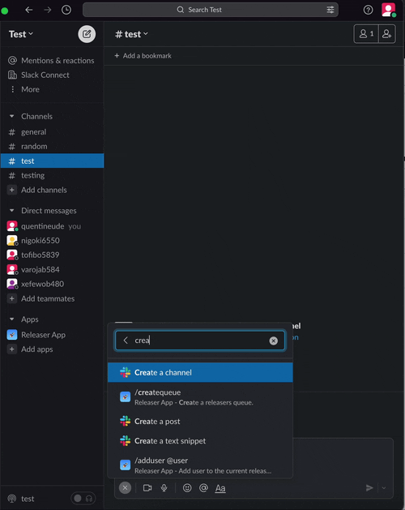

<div align=center></div>
<h1 align=center>Releaser App</h1>

<div align=center></div>

## 📖 Description

🚀 A Slack bot to manage a releasers queue.

## 🛠️ Install

```bash
npm install
```
Create a `.env` file from `.env.example`.
```bash
docker compose up -d
npm run start
```

## 👨🏻‍💻 Developer

- Quentin Eude
  - [Github](https://github.com/qeude)
  - [LinkedIn](https://www.linkedin.com/in/quentineude/)
